# 취업 시장에서 살아남기

> 취업과 이직에 관한 정보와 고민을 함께 나누는 커뮤니티

## 프로젝트 소개

**취업 시장에서 살아남기**는 취업 혹은 이직을 준비하는 사람들이 서로 취업 시장이나 회사에 대한 정보를 공유하고, 취업과 이직에 관해 가지고 있는 고민을 나누며 조언을 받을 수 있는 커뮤니티입니다.

사용자는 게시글과 댓글을 통해 다른 사용자들과 의견을 나눌 수 있으며, 게시글 작성 중에는 임시 저장 기능을 통해 작성 내용을 안전하게 보관할 수 있습니다.

---

## 핵심 구현

- 기존 HTML, CSS, JavaScript 기반 화면의 React 마이그레이션
- 재사용 가능한 공통 UI 컴포넌트 설계
- React Router를 활용한 SPA 페이지 라우팅
- Context API를 활용한 사용자 인증 상태 관리
- JWT 기반 로그인 및 인증 API 연동
- 게시글 CRUD 및 댓글 CRUD 기능 구현
- 게시글 좋아요, 조회수 및 신고 기능 구현
- 게시글 작성 중 임시 저장 및 자동 저장 상태 표시
- 이미지 업로드 및 프로필 이미지 관리
- 사용자 입력값 검증 및 오류 메시지 처리
- 토스트와 확인 모달을 활용한 사용자 피드백 제공
- Docker와 Nginx를 활용한 프런트엔드 배포 환경 구성
- GitHub Actions를 이용한 Docker 이미지 빌드 및 EC2 자동 배포

---

## 개발 인원 및 기간

### 개발 기간

- 2026.05.26 ~ 2026.08.09

### 개발 인원

- 프론트엔드 / 백엔드 1명 (본인)

### 담당 범위

- UI 계획 및 구현
- 기존 화면의 React 마이그레이션
- Backend API 연동
- 인증 상태 및 사용자 세션 관리
- Docker 이미지 빌드 및 Docker Hub 푸시
- GitHub Actions를 이용한 배포 자동화
- EC2 기반 서비스 배포 환경 구성

---

## 사용 기술 및 Tools

| 구분 | 기술 및 도구 | 활용 |
|---|---|---|
| Front-end | React 19, JavaScript | 컴포넌트 기반 UI 구현 및 상태 관리 |
| Routing | React Router 8 | SPA 라우팅 및 인증 페이지 접근 제어 |
| API | Fetch API, Fetch Event Source | REST API 호출 및 인증 헤더를 포함한 SSE 연결 |
| Build | Vite 8, npm | 개발 서버 실행 및 프로덕션 빌드 |
| Code Quality | ESLint | 정적 코드 검사 및 React Hooks 규칙 검증 |
| Web Server | Nginx | SPA 정적 파일 제공, Backend API 프록시 및 SSE 버퍼링 해제 |
| Container | Docker, Docker Compose | Front-end 이미지 생성 및 로컬 통합 실행 |
| CI/CD | GitHub Actions, Docker Hub | Lint·Build 검증, Docker 이미지 푸시 및 EC2 자동 배포 |
| Collaboration | Git, GitHub | 버전 관리 및 소스 코드 관리 |
---

## 관련 저장소

- Backend Repository: [KTB4_Neo_BE](https://github.com/100-hours-a-week/KTB4_Neo_BE)

---

## 주요 기능

### 회원 기능

- 회원가입
- 로그인 및 로그아웃
- JWT를 이용한 사용자 인증
- 로그인 상태 유지
- 사용자 정보 조회 및 수정
- 비밀번호 변경
- 프로필 이미지 등록 및 변경
- 인증이 필요한 페이지 접근 제어

### 게시글 기능

- 게시글 목록 조회
- 게시글 상세 조회
- 게시글 작성
- 게시글 수정 및 삭제
- 게시글 좋아요
- 게시글 조회수 표시
- 게시글 신고
- 페이지네이션

### 임시 저장 기능

- 게시글 작성 내용 자동 저장
- 저장 상태 표시
- 임시 저장 게시글 불러오기
- 임시 저장 내용을 게시글로 발행
- 페이지 이탈 시 작성 내용 보호

### 댓글 기능

- 댓글 목록 조회
- 댓글 작성
- 댓글 수정
- 댓글 삭제
- 작성자 권한에 따른 수정 및 삭제 버튼 표시

### 사용자 경험

- 입력값 실시간 검증
- API 요청 중 로딩 상태 처리
- 오류 및 성공 메시지 표시
- 토스트 알림
- 삭제 및 신고 확인 모달
- 존재하지 않는 주소에 대한 404 페이지 제공
- 반응형 UI 구성

---

## 폴더 구조

```text
.
├── .github/
│   └── workflows/
│       └── frontend-ci-cd.yml
├── legacy/
│   ├── assets/
│   ├── css/
│   ├── js/
│   └── *.html
├── src/
│   ├── api/
│   │   ├── authApi.js
│   │   ├── client.js
│   │   ├── commentApi.js
│   │   ├── draftApi.js
│   │   ├── postApi.js
│   │   ├── reportApi.js
│   │   ├── uploadApi.js
│   │   └── userApi.js
│   ├── assets/
│   │   └── images/
│   ├── components/
│   │   ├── auth/
│   │   ├── comments/
│   │   ├── common/
│   │   ├── form/
│   │   ├── posts/
│   │   └── user/
│   ├── contexts/
│   │   └── AuthContext.jsx
│   ├── hooks/
│   │   ├── useDraftEditor.js
│   │   └── useImageUpload.js
│   ├── pages/
│   ├── styles/
│   ├── utils/
│   ├── App.jsx
│   └── main.jsx
├── Dockerfile
├── nginx.conf
├── eslint.config.js
├── index.html
├── package.json
├── pnpm-lock.yaml
└── vite.config.js
```

### 주요 디렉터리 설명

| 경로 | 설명 |
|---|---|
| `src/api` | Backend REST API 요청 및 공통 요청 처리 |
| `src/assets` | 이미지 등 정적 리소스 |
| `src/components` | 기능별 재사용 UI 컴포넌트 |
| `src/contexts` | 인증 등 애플리케이션 전역 상태 |
| `src/hooks` | 임시 저장과 이미지 업로드 관련 커스텀 훅 |
| `src/pages` | 라우트 단위 페이지 컴포넌트 |
| `src/styles` | 페이지와 컴포넌트 스타일 |
| `src/utils` | 포맷 변환, 이미지 및 입력값 검증 유틸리티 |
| `legacy` | React 마이그레이션 이전 HTML/CSS/JavaScript 코드 |
| `.github/workflows` | GitHub Actions CI/CD 워크플로 |

---

## 페이지 구조

| 페이지 | 주요 기능 | 접근 권한 |
|---|---|---|
| 로그인 | 이메일과 비밀번호를 이용한 로그인 | 비회원 |
| 회원가입 | 사용자 정보 및 프로필 이미지 등록 | 비회원 |
| 게시글 목록 | 게시글 목록 조회 및 페이지 이동 | 전체 사용자 |
| 게시글 상세 | 게시글·댓글 조회, 좋아요 및 신고 | 전체 사용자 |
| 게시글 작성 | 새 게시글 작성 및 임시 저장 | 로그인 사용자 |
| 게시글 수정 | 작성한 게시글 수정 | 게시글 작성자 |
| 마이페이지 | 사용자 정보 조회 및 프로필 수정 | 로그인 사용자 |
| 비밀번호 변경 | 기존 비밀번호 확인 및 새 비밀번호 설정 | 로그인 사용자 |
| 404 | 존재하지 않는 경로 안내 | 전체 사용자 |

---

## UI 화면

화면 이미지는 `docs/screenshots/` 디렉터리에 저장되어 있습니다.

| 페이지 및 기능 | 경로 | 화면 | 주요 기능 |
|---|---|---|---|
| 로그인 | `/login` | 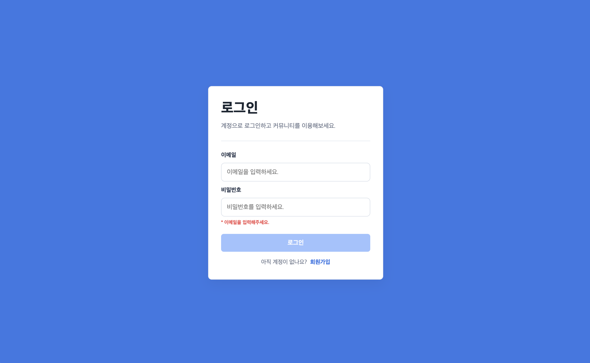 | 이메일·비밀번호 입력, 입력값 검증, 로그인 |
| 회원가입 | `/signup` | 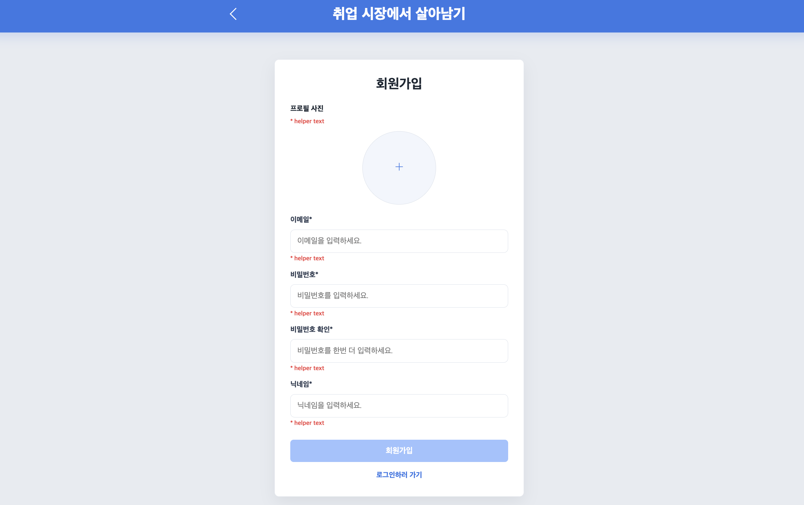 | 회원 정보 입력, 프로필 이미지 등록, 회원가입 |
| 로그아웃 | 공통 헤더 | 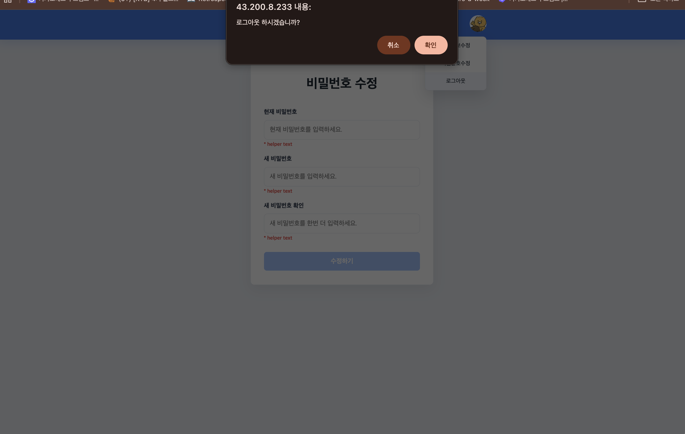 | 사용자 인증 정보 제거, 로그인 상태 초기화 및 로그인 페이지 이동 |
| 게시글 목록 | `/posts` |  | 게시글 목록 조회, 페이지네이션, 게시글 작성 페이지 이동 |
| 게시글 상세 | `/posts/:postId` |  | 게시글 조회, 좋아요, 댓글 작성·수정·삭제, 게시글 신고 |
| 게시글 작성 | `/posts/new` | 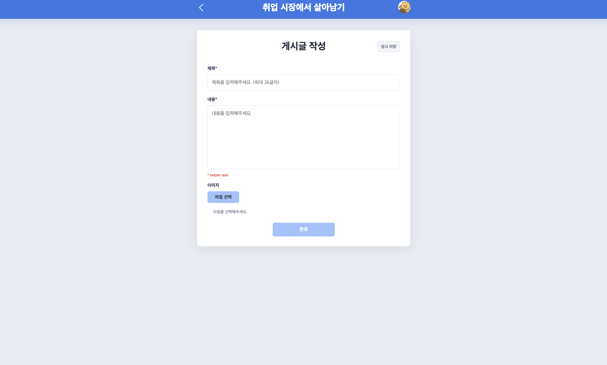 | 제목·내용·이미지 입력 및 게시글 등록 |
| 임시글 복구 확인 모달 | `/posts/new` | 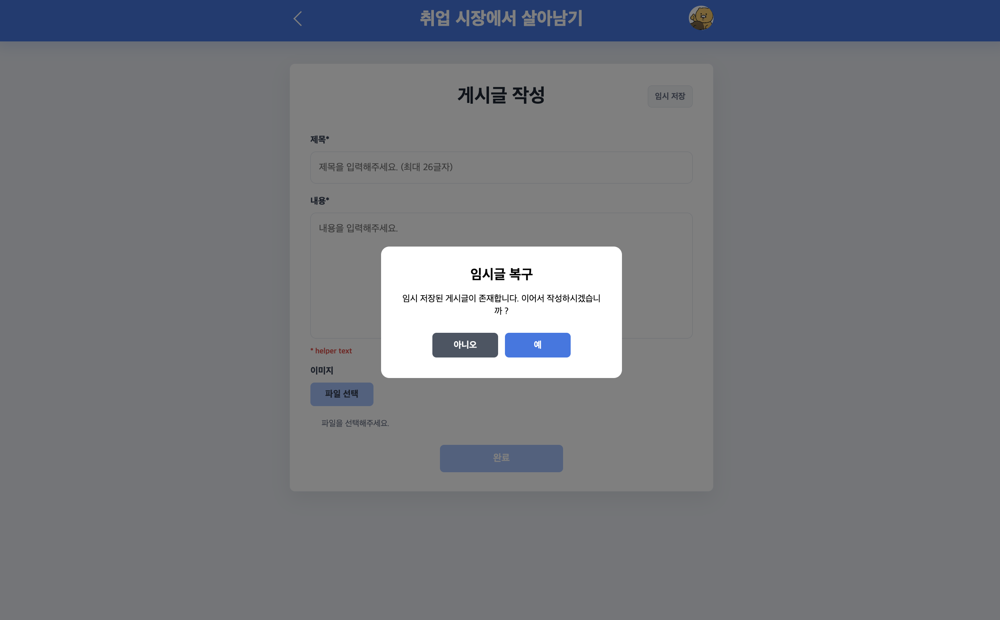 | 저장된 임시글 확인, 임시글 복구 또는 새 글 작성 선택 |
| 임시글 자동 저장 | `/posts/new` | 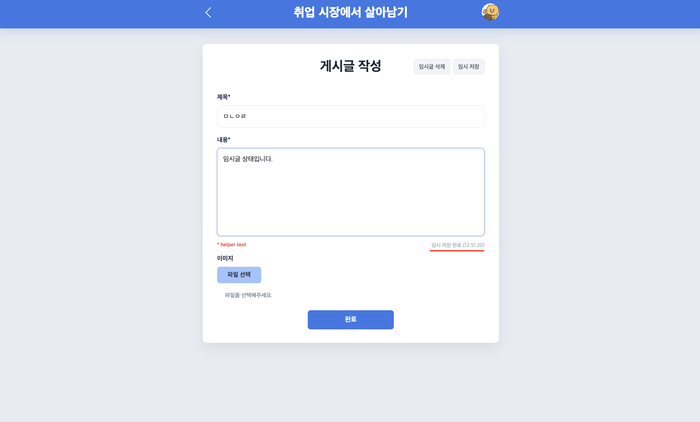 | 게시글 작성 내용 자동 저장 및 저장 상태 표시 |
| 명시적 임시 저장 | `/posts/new` | 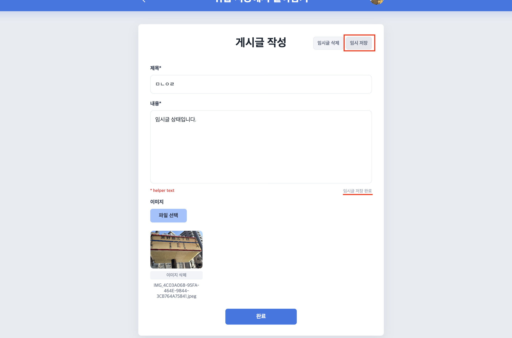 | 사용자가 임시 저장 버튼을 눌러 작성 내용 저장 |
| 임시글 삭제 | `/posts/new` | 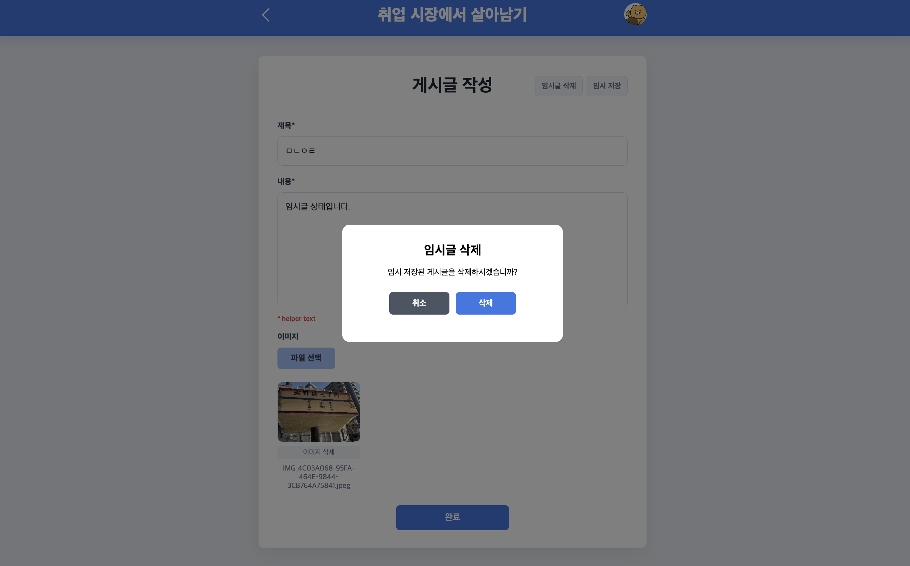 | 저장된 임시글 삭제 및 작성 상태 초기화 |
| 게시글 수정 | `/posts/:postId/edit` | 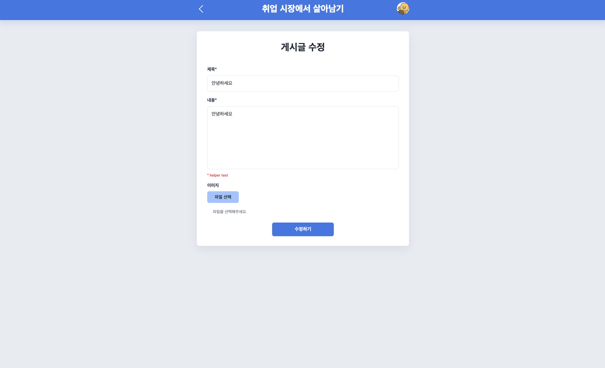 | 기존 게시글 조회, 내용 및 이미지 수정 |
| 마이페이지 | `/mypage` | 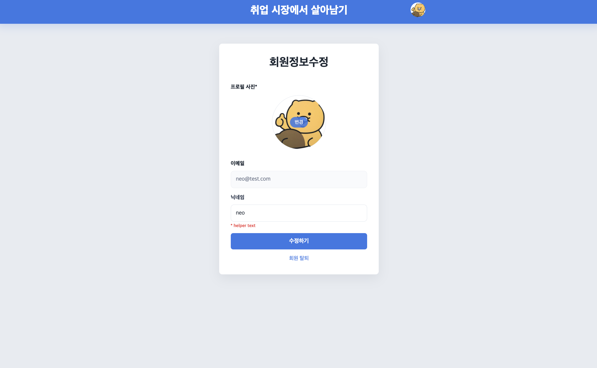 | 회원 정보 조회, 닉네임 및 프로필 이미지 수정, 회원 탈퇴 |
| 비밀번호 변경 | `/mypage/password` | 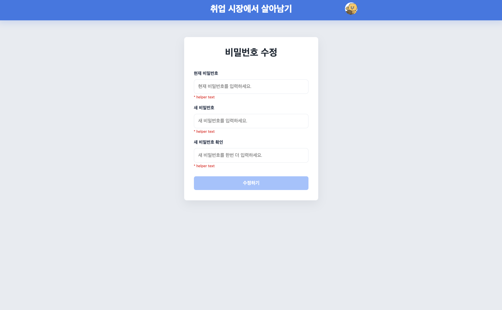 | 기존 비밀번호 확인, 새 비밀번호 입력 및 변경 |
| 신고 모달 | 게시글 상세 화면 | 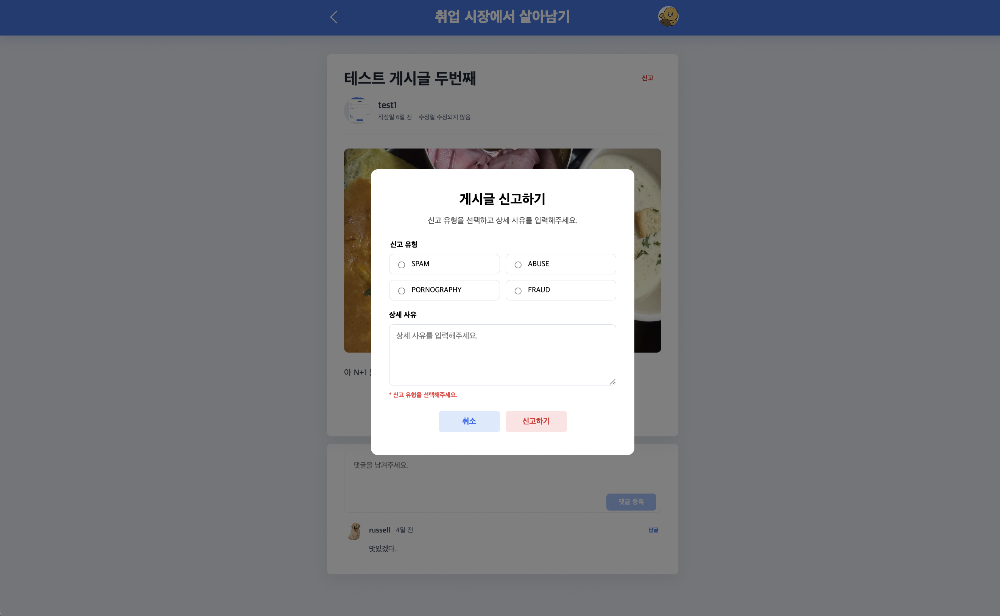 | 신고 유형 선택, 신고 사유 입력 및 제출 |
| 회원 탈퇴 | `/mypage` | 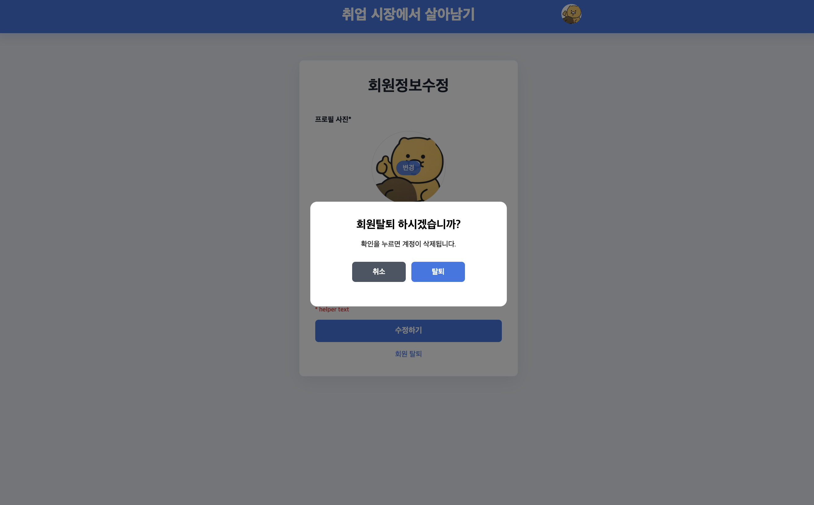 | 회원 탈퇴 의사 확인, 사용자 계정 삭제 및 인증 상태 초기화 |

---

## 회고

이번 프로젝트를 통해 정적인 HTML, CSS, JavaScript 화면을 React 기반 구조로 마이그레이션하는 과정을 경험했습니다.
화면을 컴포넌트 단위로 분리하면서 재사용성과 상태 관리의 중요성을 배울 수 있었습니다.
특히 게시글 임시 저장과 인증 상태처럼 복잡한 기능을 커스텀 훅과 Context로 분리하며 관심사 분리를 고민했습니다.
또한 Backend API 연동부터 Docker 이미지 생성, GitHub Actions와 EC2 배포까지 전체 서비스 흐름을 직접 구성했습니다.
혼자 프론트엔드와 백엔드를 모두 개발하면서 기능 구현뿐 아니라 유지보수와 배포를 고려한 설계의 필요성을 체감했습니다.
